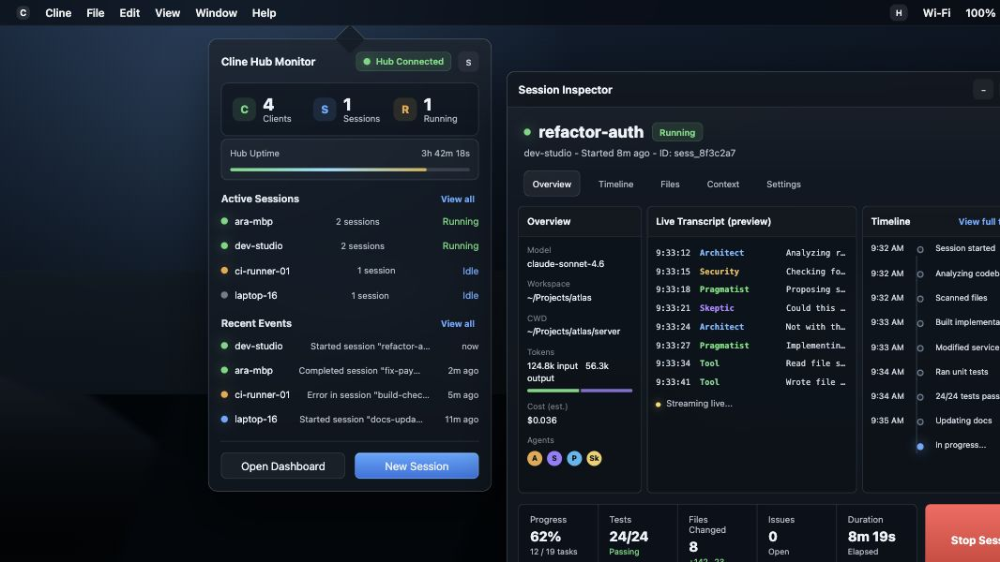

```text
 _________  ________  _______   _____ ______   ________  ________
|\___   ___\\   __  \|\  ___ \ |\   _ \  _   \|\   __  \|\   __  \
\|___ \  \_\ \  \|\  \ \   __/|\ \  \\\__\ \  \ \  \|\ /\ \  \|\  \
     \ \  \ \ \   _  _\ \  \_|/_\ \  \\|__| \  \ \   __  \ \  \\\  \
      \ \  \ \ \  \\  \\ \  \_|\ \ \  \    \ \  \ \  \|\  \ \  \\\  \
       \ \__\ \ \__\\ _\\ \_______\ \__\    \ \__\ \_______\ \_______\
        \|__|  \|__|\|__|\|_______|\|__|     \|__|\|_______|\|_______|
```

### Preview



### Architecture overview

```
Any Client (CLI, VS Code, agents)
    │
    │  ws://  ui.notify / ui.show_window commands
    ▼
Hub WebSocket Server (@trembo/core/hub/server.ts)
    │
    │  broadcasts ui.notify / ui.show_window events to ALL subscribers
    ▼
Menu Bar Sidecar (apps/examples/menubar/sidecar/index.ts)  ← TypeScript/Bun process
    │
    │  JSON lines on stdout: hub_state / notification / ready
    ▼
Rust Tauri App (apps/examples/menubar/src-tauri/src/main.rs)
    │
    ├── Hub Monitor Window (ui/index.html)
    │     ● Live hub status, uptime, clients, sessions
    │     ● Running session tracker and inspector
    │     ● Recent events and background-session launcher
    │
    │
    ├── System Tray Icon with dynamic menu
    │     ● Hub Connected — 3 clients, 2 sessions
    │     ─────────────────
    │     5 notifications
    │     ─────────────────
    │     Quit Trembo Hub
    │
    └── Logs notifications to stderr (with severity)
```

The menubar app is a thin Tauri shell that subscribes to a Trembo hub over WebSocket and surfaces what it sees — hub health, running sessions, and notifications — as a compact window plus a system tray icon. Any client that speaks the hub protocol (the Trembo CLI, the VS Code extension, custom agents) can push `ui.notify` and `ui.show_window` commands; the hub fans those out to every subscriber, and this app is one of them.

### Dev commands

Run from `apps/examples/menubar/`:

- `bun run dev:ui` — run only the Hub Monitor UI at <http://127.0.0.1:3466/> with preview data.
- `bun run dev` — run the full Tauri app against the real hub sidecar.
- `bun run typecheck` — TypeScript check.
