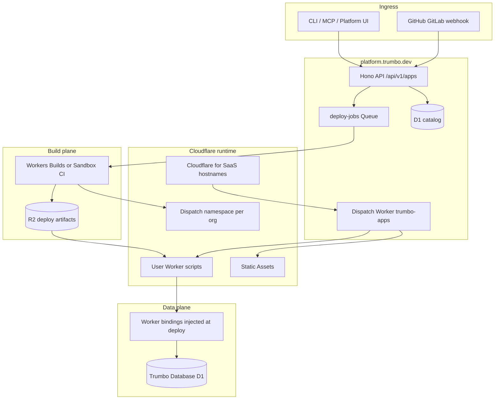

# Trumbo Agent Apps & Database — Full Platform Roadmap

End-to-end engineering and product plan for **Vercel-like app deployment** and **managed SQL (Database as a Service)** on Cloudflare, sold as Trumbo SKUs under **Agentic Cloud**.

Complements [`cloudflare-resell-roadmap.md`](./cloudflare-resell-roadmap.md) and [`cloudflare-technical-roadmap.md`](./cloudflare-technical-roadmap.md).

Last updated: July 26, 2026

---

## Executive summary

Trumbo already ships **Compute** (Sandbox, Browser, Cloud Agents, Automations) and **Database** facades (Memory, Store, Artifacts, Knowledge) for agents. The next platform layer is:

1. **Trumbo Agent Apps** — deploy customer code (static sites, Workers, full-stack frameworks) with CDN, preview URLs, and custom domains.
2. **Trumbo Database** — provision isolated SQL databases for those apps (and for direct API use), with connection strings, branching, and backups.

Both run on Cloudflare infrastructure (Workers for Platforms, Cloudflare for SaaS, D1, R2, Queues, Workers Builds) but are **100% Trumbo-branded**. Customers never buy Cloudflare units. All auth, quotas, and billing stay on `platform.trumbo.dev` / `api.trumbo.dev`.

**Default URLs:** `https://{app}.{org-slug}.apps.trumbo.dev` (production), `https://{preview-id}.{app}.apps.trumbo.dev` (previews).

**Bottom line:** Agent Apps is a product layer on top of existing Sandbox + R2 + Workers, not a new cloud. Database is a separate managed SKU that deployed apps bind to via env vars and that agents can provision from chat.

---

## Product map (Agentic Cloud)

```text
Agentic Cloud
├── Compute (shipped)
│   ├── Cloud Agents
│   ├── Sandbox
│   ├── Browser Run
│   └── Automations
├── Deploy (this roadmap — Phase 1–4)
│   └── Agent Apps
└── Database
    ├── Agent Database (shipped — agent-facing)
    │   ├── Memory
    │   ├── Store
    │   └── Artifacts
    ├── Knowledge (shipped — RAG)
    └── Trumbo Database (this roadmap — DBaaS for apps)
```

| Product | Audience | Backend | Status |
| --- | --- | --- | --- |
| Memory / Store / Artifacts | Trumbo Agent (session state, KV-like, blobs) | Platform D1 + R2 | Shipped |
| Knowledge | Trumbo Agent (RAG) | AI Search + R2 | Shipped |
| **Trumbo Database** | **Customer apps + agents** | **Per-tenant D1 (or DO SQLite facet)** | Planned |
| **Agent Apps** | **Customer apps (human traffic)** | **Workers for Platforms + Static Assets** | Planned |

Memory/Store remain **agent runtime** primitives. Trumbo Database is **durable SQL for applications** (Postgres-like DX, D1-compatible wire format).

---

## Vercel → Cloudflare → Trumbo mapping

| Vercel capability | Cloudflare primitive | Trumbo surface |
| --- | --- | --- |
| Global CDN + HTTPS | Edge network (automatic on zone) | Included on every deploy |
| Production URL | Custom hostname on Trumbo zone | `{app}.{org}.apps.trumbo.dev` |
| Preview deployments | Dispatch namespace + route rules | `{hash}.{app}.apps.trumbo.dev` |
| Custom domain + SSL | **Cloudflare for SaaS** (custom hostnames) | `/apps/{id}/domains` UI + DNS wizard |
| Serverless functions | User Worker in dispatch namespace | `functions/` or Worker entry in repo |
| Static assets | Workers Static Assets / Assets binding | `public/` or framework output |
| Edge middleware | User Worker `fetch` handler | Same Worker script |
| Git push → build | **Workers Builds** or Sandbox container CI | GitHub/GitLab app + webhook |
| Env vars / secrets | Platform D1 + encrypted at rest | Per-app, per-environment |
| Project isolation | Dispatch namespace per org (or per app) | Server-side org scope |
| Logs | Workers Logs / Logpush | `/apps/{id}/logs` (tail + export) |
| Analytics | Workers Analytics Engine (optional) | Usage dashboard |
| Database (Postgres) | **D1** (+ Hyperdrive later for external Postgres) | **Trumbo Database** SKU |

---

## Architecture

### High-level flow



### Request routing (production)

```text
Visitor → customer.com (CNAME → apps.trumbo.dev)
       → Cloudflare for SaaS custom hostname (TLS)
       → */* route on Trumbo zone → Dispatch Worker
       → lookup hostname in D1 → script_name in namespace
       → env.DISPATCHER.get(script_name).fetch(request)
       → User Worker + Static Assets
```

### Tenancy model

| Layer | Isolation unit | Notes |
| --- | --- | --- |
| Catalog | `scope_type` + `scope_id` (org) | Same pattern as Sandbox, Memory |
| Dispatch namespace | One per org (MVP) or per app (scale) | Cloudflare WfP limit: plan accordingly |
| User Worker script | One script id per app × environment | `prod`, `preview-{id}` |
| Trumbo Database | One D1 database id per logical DB | Named binding `TRUMBO_DB` at deploy |
| Secrets | Encrypted blob in D1, injected as Worker secrets | Never returned in API after write |

---

## Trumbo Agent Apps — product spec

### Customer-facing capabilities

| Capability | MVP | V1 | V2 |
| --- | --- | --- | --- |
| CLI deploy (`trumbo apps deploy`) | Yes | Yes | Yes |
| Platform UI `/apps` | Yes | Yes | Yes |
| Static site (HTML/CSS/JS) | Yes | Yes | Yes |
| Worker / API routes | Yes | Yes | Yes |
| Framework adapters (Astro, Remix, Next partial) | No | Yes | Yes |
| Preview URL per deploy | Yes | Yes | Yes |
| Production promote | Manual | One-click | Git branch rules |
| Custom domain | No | Yes | Yes |
| Git auto-deploy | No | Yes | Yes |
| PR preview comments | No | No | Yes |
| Rollback | No | Yes | Yes |
| Log tail | Basic | Yes | Yes |
| Agent `deploy` from chat | No | Yes | Yes |

### Environments

| Environment | URL pattern | Lifecycle |
| --- | --- | --- |
| **Production** | `{app}.{org}.apps.trumbo.dev` | Promoted from preview or direct deploy to prod |
| **Preview** | `{deploy-id}.{app}.apps.trumbo.dev` | Created per deploy; TTL 30 days (tier-configurable) |
| **Custom** | `www.customer.com` | Cloudflare for SaaS; SSL status in UI |

### Supported project types (phased)

**Phase 1 (MVP)**

- Static export (`dist/`, `out/`, `build/`)
- Single Worker script (`worker.js` / `src/index.ts` + wrangler-compatible bundle)
- `trumbo.json` manifest (build command, output dir, worker entry)

**Phase 2**

- Vite / Astro static + server adapters for Workers
- Remix Cloudflare adapter
- Environment-specific builds

**Phase 3**

- Next.js on Workers (@opennextjs/cloudflare or equivalent)
- Monorepo detection (Turborepo / Nx root)

**Explicit non-goals (V1)**

- Long-running Node servers (no K8s-style containers for apps)
- Edge-unfriendly frameworks without adapter
- Arbitrary Docker deploy (that stays Sandbox for agents)

---

## Trumbo Database — Database as a Service

### Positioning

**Trumbo Database** is managed SQL for **applications you deploy** (and for direct programmatic use). It is not a replacement for Memory/Store (agent scratch state) or Knowledge (RAG).

| | Memory / Store | Trumbo Database |
| --- | --- | --- |
| **Primary user** | Agent runtime | App + agent provisioning |
| **API shape** | Key-value, events, search | SQL, migrations, backups |
| **Isolation** | Rows in platform D1 | Dedicated D1 database per instance |
| **Binding** | REST / MCP only | Worker binding + HTTP API + MCP |
| **Billing meter** | Rows / storage MB | Storage GB + read/write units |

### Customer-facing capabilities

| Capability | MVP | V1 | V2 |
| --- | --- | --- | --- |
| Create database (UI + API) | Yes | Yes | Yes |
| Connection string / binding name | Yes | Yes | Yes |
| SQL console (read-only MVP) | No | Yes | Yes |
| Migrations (`trumbo db migrate`) | Yes | Yes | Yes |
| Branch (copy schema + optional data) | No | Preview only | Yes |
| Point-in-time backup | No | Daily | Hourly (Max+) |
| Attach to Agent App on deploy | Yes | Yes | Yes |
| MCP `database_create`, `database_query` | Yes | Yes | Yes |
| Hyperdrive to external Postgres | No | No | Enterprise |

### Backend options (decision)

| Option | Pros | Cons | Recommendation |
| --- | --- | --- | --- |
| **D1 per database** | Native Workers binding, serverless, already in stack | 10 GB soft limit per DB, SQLite semantics | **MVP default** |
| **DO SQLite facet** | Strong isolation inside supervisor DO | Ops complexity, facet limits | Phase 2 for edge-only micro-DBs |
| **Hyperdrive + Neon/Supabase** | Real Postgres, familiar | External COGS, not fully Trumbo-hosted | Enterprise tier only |

**MVP:** One Cloudflare **D1 database** per Trumbo Database instance, created via [D1 HTTP API](https://developers.cloudflare.com/api/resources/d1/), with binding injected into user Worker on deploy.

### Database lifecycle

```text
Create DB (API/UI)
  → D1 createDatabase(name: trumbo-{org}-{slug})
  → Store metadata in app_databases (id, d1_uuid, scope, region hint)
  → Run bootstrap migration (optional)
  → Return binding name TRUMBO_DB + database_id for REST

Deploy App
  → Resolve attached databases for app_id + environment
  → Include in Worker metadata / dispatch binding config

Delete DB
  → Confirm no app bindings
  → D1 deleteDatabase
  → Soft-delete row + audit log
```

### SQL & migrations

- **Wire format:** D1 HTTP API from platform; Workers use native `env.TRUMBO_DB` binding in customer scripts.
- **Migrations:** SQL files in repo `db/migrations/` or platform-stored migration history table per database id.
- **CLI:** `trumbo db create`, `trumbo db migrate`, `trumbo db shell` (read-only first), `trumbo db attach --app my-app`.

---

## Platform API (authoritative)

All routes on `api.trumbo.dev`, org-scoped via session cookie or `Authorization: Bearer` + `X-Org-Id`. Open-source clients cannot bypass limits.

### Agent Apps

| Method | Path | Description |
| --- | --- | --- |
| `GET` | `/api/v1/apps` | List apps for org |
| `POST` | `/api/v1/apps` | Create app (name, framework hint, repo link optional) |
| `GET` | `/api/v1/apps/{id}` | App detail + latest deploy |
| `PATCH` | `/api/v1/apps/{id}` | Update name, build settings |
| `DELETE` | `/api/v1/apps/{id}` | Delete app + undeploy scripts |
| `POST` | `/api/v1/apps/{id}/deploy` | Upload bundle or trigger build from linked repo |
| `GET` | `/api/v1/apps/{id}/deploys` | Deploy history |
| `GET` | `/api/v1/apps/{id}/deploys/{deployId}` | Deploy status, logs, preview URL |
| `POST` | `/api/v1/apps/{id}/deploys/{deployId}/promote` | Promote preview → production |
| `POST` | `/api/v1/apps/{id}/rollback` | Rollback prod to prior deploy |
| `GET/PUT` | `/api/v1/apps/{id}/env` | Environment variables (encrypted secrets) |
| `GET/POST/DELETE` | `/api/v1/apps/{id}/domains` | Custom hostnames (V1) |
| `GET` | `/api/v1/apps/{id}/logs` | Tail / search logs |
| `POST` | `/api/v1/apps/{id}/git/connect` | Install GitHub/GitLab app (V1) |

### Trumbo Database

| Method | Path | Description |
| --- | --- | --- |
| `GET` | `/api/v1/databases` | List databases |
| `POST` | `/api/v1/databases` | Create database `{ name, region? }` |
| `GET` | `/api/v1/databases/{id}` | Metadata, usage, binding name |
| `DELETE` | `/api/v1/databases/{id}` | Delete (with safeguards) |
| `POST` | `/api/v1/databases/{id}/query` | Parameterized SQL (rate-limited, audited) |
| `GET/POST` | `/api/v1/databases/{id}/migrations` | List / apply migrations |
| `POST` | `/api/v1/databases/{id}/attach` | Attach to app `{ appId, bindingName }` |
| `DELETE` | `/api/v1/databases/{id}/attach/{appId}` | Detach |
| `POST` | `/api/v1/databases/{id}/backup` | On-demand backup (V1) |
| `GET` | `/api/v1/databases/{id}/backups` | List backups |

### MCP tools (api.trumbo.dev/v1/mcp)

| Tool | Phase |
| --- | --- |
| `app_create`, `app_deploy`, `app_list`, `app_get_deploy_status` | MVP |
| `app_set_env`, `app_add_domain` | V1 |
| `database_create`, `database_list`, `database_query`, `database_attach_app` | MVP |
| `database_migrate` | V1 |

---

## D1 schema (platform catalog)

Migration series starting at **`0060_agent_apps.sql`**.

### Apps

```sql
-- apps: logical project
CREATE TABLE apps (
  id TEXT PRIMARY KEY,
  scope_type TEXT NOT NULL,
  scope_id TEXT NOT NULL,
  name TEXT NOT NULL,
  slug TEXT NOT NULL,
  framework TEXT,                    -- static | worker | astro | remix | next
  repo_id TEXT,                    -- optional link to git_repos
  default_branch TEXT,
  build_command TEXT,
  output_directory TEXT,
  worker_entry TEXT,
  production_deploy_id TEXT,
  created_at INTEGER NOT NULL,
  updated_at INTEGER NOT NULL,
  UNIQUE(scope_type, scope_id, slug)
);

-- app_deploys: each build + upload
CREATE TABLE app_deploys (
  id TEXT PRIMARY KEY,
  app_id TEXT NOT NULL REFERENCES apps(id),
  status TEXT NOT NULL,            -- queued | building | uploading | live | failed | cancelled
  environment TEXT NOT NULL,       -- production | preview
  commit_sha TEXT,
  commit_message TEXT,
  preview_url TEXT,
  script_name TEXT,                -- dispatch namespace script id
  artifact_r2_key TEXT,
  build_log_r2_key TEXT,
  error_message TEXT,
  created_at INTEGER NOT NULL,
  completed_at INTEGER
);

-- app_env_vars: per app, per environment
CREATE TABLE app_env_vars (
  id TEXT PRIMARY KEY,
  app_id TEXT NOT NULL,
  environment TEXT NOT NULL,
  key TEXT NOT NULL,
  value_encrypted TEXT NOT NULL,
  is_secret INTEGER NOT NULL DEFAULT 1,
  created_at INTEGER NOT NULL,
  UNIQUE(app_id, environment, key)
);

-- app_custom_hostnames (V1)
CREATE TABLE app_custom_hostnames (
  id TEXT PRIMARY KEY,
  app_id TEXT NOT NULL,
  hostname TEXT NOT NULL,
  cf_custom_hostname_id TEXT,
  ssl_status TEXT,
  verification_status TEXT,
  created_at INTEGER NOT NULL,
  UNIQUE(hostname)
);

-- app_database_bindings
CREATE TABLE app_database_bindings (
  app_id TEXT NOT NULL,
  database_id TEXT NOT NULL,
  binding_name TEXT NOT NULL DEFAULT 'TRUMBO_DB',
  environment TEXT NOT NULL DEFAULT 'production',
  PRIMARY KEY (app_id, database_id, environment)
);
```

### Trumbo Database

```sql
CREATE TABLE trumbo_databases (
  id TEXT PRIMARY KEY,
  scope_type TEXT NOT NULL,
  scope_id TEXT NOT NULL,
  name TEXT NOT NULL,
  slug TEXT NOT NULL,
  d1_database_id TEXT NOT NULL,    -- Cloudflare D1 uuid
  d1_database_name TEXT NOT NULL,
  region TEXT DEFAULT 'auto',
  storage_bytes INTEGER NOT NULL DEFAULT 0,
  status TEXT NOT NULL DEFAULT 'active',
  created_at INTEGER NOT NULL,
  updated_at INTEGER NOT NULL,
  deleted_at INTEGER,
  UNIQUE(scope_type, scope_id, slug)
);

CREATE TABLE trumbo_database_migrations (
  id TEXT PRIMARY KEY,
  database_id TEXT NOT NULL,
  version INTEGER NOT NULL,
  name TEXT NOT NULL,
  sql_hash TEXT NOT NULL,
  applied_at INTEGER NOT NULL,
  UNIQUE(database_id, version)
);

CREATE TABLE trumbo_database_backups (
  id TEXT PRIMARY KEY,
  database_id TEXT NOT NULL,
  r2_key TEXT NOT NULL,
  size_bytes INTEGER,
  created_at INTEGER NOT NULL
);
```

### Plan limits (extend `subscription_plans`)

```sql
ALTER TABLE subscription_plans ADD COLUMN apps_enabled INTEGER NOT NULL DEFAULT 0;
ALTER TABLE subscription_plans ADD COLUMN apps_max_count INTEGER NOT NULL DEFAULT 0;
ALTER TABLE subscription_plans ADD COLUMN apps_deploys_per_day INTEGER NOT NULL DEFAULT 0;
ALTER TABLE subscription_plans ADD COLUMN apps_build_minutes_monthly INTEGER NOT NULL DEFAULT 0;
ALTER TABLE subscription_plans ADD COLUMN apps_custom_domains INTEGER NOT NULL DEFAULT 0;
ALTER TABLE subscription_plans ADD COLUMN trumbo_db_enabled INTEGER NOT NULL DEFAULT 0;
ALTER TABLE subscription_plans ADD COLUMN trumbo_db_max_instances INTEGER NOT NULL DEFAULT 0;
ALTER TABLE subscription_plans ADD COLUMN trumbo_db_max_storage_mb INTEGER NOT NULL DEFAULT 0;
ALTER TABLE subscription_plans ADD COLUMN trumbo_db_max_rows INTEGER NOT NULL DEFAULT 0;
```

Suggested tier defaults:

| Limit | Pro | Max | Ultra |
| --- | --- | --- | --- |
| Apps enabled | 3 apps | 25 apps | Unlimited |
| Deploys / day | 10 | 100 | 500 |
| Build minutes / mo | 100 | 1,000 | 5,000 |
| Custom domains | 0 | 5 | 25 |
| Trumbo DB instances | 1 | 10 | 50 |
| Trumbo DB storage | 256 MB | 2 GB | 10 GB |

Meter overages via credits (same model as Browser / Security scans).

---

## Build & deploy pipeline

### Option A — Workers Builds (preferred when GA-ready)

1. Webhook or API enqueues `deploy-jobs` message `{ appId, deployId, source: git | upload }`.
2. Consumer triggers Cloudflare Workers Builds linked to repo or uploaded tarball.
3. On success, artifact pushed to dispatch namespace via [Workers for Platforms API](https://developers.cloudflare.com/cloudflare-for-platforms/workers-for-platforms/).
4. Update `app_deploys.status = live`, set `preview_url`.

### Option B — Sandbox container CI (fallback / MVP)

1. Reuse `trumbo-web-sandbox` container (already in production).
2. Clone repo or extract upload to `/workspace`.
3. Run `build_command` (detected or from manifest).
4. Bundle Worker with esbuild; upload static assets to R2.
5. Register script in dispatch namespace via Cloudflare API.
6. Destroy sandbox; persist logs to R2.

**MVP recommendation:** Option B first (full control, matches existing Sandbox ops). Migrate hot paths to Workers Builds when build-minute economics justify it.

### Dispatch Worker (`trumbo-apps`)

Deployed on Trumbo zone with route `*/*` (and SaaS hostnames):

```typescript
// Pseudocode — hostname → script lookup
export default {
  async fetch(request: Request, env: Env) {
    const host = new URL(request.url).hostname;
    const route = await env.APP_ROUTES.get(host); // KV or DO cache
    if (!route) return new Response("Not found", { status: 404 });
    const worker = env.DISPATCHER.get(route.scriptName);
    return worker.fetch(request);
  },
};
```

Route table populated on each successful deploy; invalidated on delete/rollback.

---

## Platform UI

### Navigation (`app-nav.ts`)

Add under **Agentic Cloud**:

```text
Deploy
  └── Agent Apps          → /apps

Database (existing section)
  ├── Knowledge
  ├── Memory
  ├── Store
  ├── Artifacts
  └── Trumbo Database     → /databases
```

### `/apps` page (match Sandbox / Memory design)

- Stats strip: apps count, deploys today, build minutes used, bandwidth (when metered).
- App list GridBox: name, framework, prod URL, last deploy status, actions.
- App detail: deploy history, env vars, domains, linked databases, API + Quickstart curls.
- Empty state: `trumbo apps create` + link to docs.

### `/databases` page

- Stats strip: instances, storage used, rows, queries (24h).
- Instance list + create modal.
- Detail: connection info (binding name, `database_id`), migrations, attach to app, SQL console (V1), backups.
- Quickstart + API reference block (same pattern as Memory/Store).

---

## CLI & open-source clients

### CLI commands ( `@trumbodev/cli` )

```bash
trumbo apps create my-site --framework static
trumbo apps deploy ./dist --app my-site
trumbo apps env set API_URL=https://... --app my-site
trumbo apps logs --app my-site --tail

trumbo db create analytics --region auto
trumbo db migrate --database analytics
trumbo db attach analytics --app my-site --binding TRUMBO_DB
```

VS Code: Cloud Platform panel tab **Apps** + **Databases** (mirror MCP tools).

All commands hit `api.trumbo.dev`; tier checks server-side.

---

## Billing & metering

| Meter | Source | Bill as |
| --- | --- | --- |
| Build minutes | Sandbox CI or Workers Builds duration | Included quota + credits |
| Deploy count | `app_deploys` rows / day | Hard cap per tier |
| Bandwidth / requests | Workers Analytics (optional) | Credits over included |
| Trumbo DB storage | D1 `meta` + periodic scan | Included MB + credits |
| Trumbo DB reads/writes | D1 analytics API | Included RU + credits |
| Custom hostnames | Cloudflare for SaaS count | Max tier feature + per-host credits |

Record usage in existing `usage_events` with operations:

- `apps.deploy`
- `apps.build_minutes`
- `database.storage`
- `database.query`

Admin: unit economics tab extension (COGS per build minute, per D1 GB).

---

## Security & compliance

| Concern | Mitigation |
| --- | --- |
| Cross-tenant deploy | All API routes `resolveScope()`; dispatch script names include org id |
| Secret leakage | Encrypt env values; never echo in logs; Worker secrets via CF API |
| Arbitrary code in user Workers | Workers for Platforms isolation; CPU/time limits per invocation |
| SQL injection (DB API) | Parameterized queries only; read-only role for console MVP |
| Custom domain takeover | CF SaaS ownership verification before activate |
| Abuse (crypto miners) | Build scanning + rate limits + ToS enforcement |
| Open-source bypass | Zero trust on client; quotas on Worker that owns dispatch API key |

---

## Phased delivery plan

### Phase 0 — Design & infra prep (2 weeks)

- [ ] Cloudflare account: enable **Workers for Platforms**, create dispatch namespace `trumbo-customers-dev`.
- [ ] Wrangler: document API token scopes (`Workers Scripts:Edit`, `D1:Edit`, `SSL and Certificates`).
- [ ] Spike: upload hello-world Worker to namespace; route `test.apps.trumbo.dev`.
- [ ] Finalize `trumbo.json` manifest schema.
- [ ] This roadmap reviewed + tier limits approved.

**Exit:** Hello World live at `*.apps.trumbo.dev` internally.

---

### Phase 1 — MVP: Deploy static + Worker (6–8 weeks)

**Agent Apps**

- [ ] Migration `0060_agent_apps.sql` + plan columns
- [ ] `lib/apps/` — catalog, deploy orchestration, R2 artifacts
- [ ] Queue `deploy-jobs` + consumer (Sandbox build path)
- [ ] Dispatch Worker `trumbo-apps` + KV route cache
- [ ] REST `/api/v1/apps/*` (create, deploy upload, list, status)
- [ ] MCP: `app_create`, `app_deploy`, `app_list`
- [ ] UI `/apps` — list, detail, deploy trigger, quickstart
- [ ] CLI `trumbo apps deploy`
- [ ] Docs + marketing one-pager

**Trumbo Database (MVP)**

- [ ] Migration `0061_trumbo_database.sql`
- [ ] `lib/trumbo-database/` — D1 provisioning via CF API, metadata
- [ ] REST `/api/v1/databases/*` (create, list, delete, query w/ limits)
- [ ] MCP: `database_create`, `database_list`, `database_query`
- [ ] UI `/databases` — Sandbox-style stats + quickstart
- [ ] Attach DB to app at deploy (binding metadata)
- [ ] CLI `trumbo db create`, `trumbo db migrate`

**Exit:** Customer deploys static site + optional Worker; creates D1-backed database; agent can deploy via MCP.

---

### Phase 2 — Git CI + previews (4–6 weeks)

- [ ] GitHub App (reuse git oauth infra) → webhook → auto deploy
- [ ] Preview deploy per push; prod promote button
- [ ] Env vars UI + CLI; secret rotation
- [ ] Build logs in UI (stream from R2)
- [ ] Framework detectors (Vite, Astro static)
- [ ] Database migrations from repo CI
- [ ] Usage meters on `/usage` + `/developers`-style charts

**Exit:** Push to `main` deploys preview; promote to prod; DB migrations in pipeline.

---

### Phase 3 — Custom domains + production hardening (4–6 weeks)

- [ ] Cloudflare for SaaS: custom hostnames API + UI wizard
- [ ] SSL status polling; DNS verification instructions
- [ ] Rollback + deploy history diff (artifact hash)
- [ ] Rate limits per app (optional Worker subrequest cap)
- [ ] Trumbo DB: daily backup to R2; restore flow
- [ ] Agent chat: "deploy my app" tool wired in Agent Workspace
- [ ] Security review + pen test on dispatch boundary

**Exit:** Production custom domain on customer app; backups; enterprise-ready audit trail.

---

### Phase 4 — Scale & framework breadth (ongoing)

- [ ] Workers Builds migration (reduce Sandbox CI COGS)
- [ ] Next.js / Remix adapters documented + templates
- [ ] PR preview comments (GitHub Checks API)
- [ ] Multi-region D1 hint (when CF supports selection)
- [ ] Database branches for preview apps (schema clone)
- [ ] Hyperdrive + managed Postgres tier (Enterprise)
- [ ] Analytics Engine per-app dashboards
- [ ] Edge config / feature flags SKU (KV-backed)

---

## Wrangler / infrastructure changes

```toml
# wrangler.toml additions (conceptual)

[[dispatch_namespaces]]
binding = "DISPATCHER"
namespace = "trumbo-customers"

[[queues.producers]]
queue = "deploy-jobs"
binding = "DEPLOY_QUEUE"

[[queues.consumers]]
queue = "deploy-jobs"
max_batch_size = 1
max_retries = 3

# Route on Trumbo zone (production)
# */* → trumbo-apps dispatch router worker
```

New Worker scripts:

| Script | Role |
| --- | --- |
| `trumbo-apps` | Hostname router → dispatch namespace |
| `trumbo-web` (existing) | Platform API + UI (apps routes in Hono) |

Secrets (Workers secrets, not in repo):

- `CF_ACCOUNT_ID`, `CF_API_TOKEN` (scoped)
- `APPS_DISPATCH_NAMESPACE_ID`
- `CF_SAAS_ZONE_ID` (V1 custom domains)

---

## Testing strategy

| Layer | Tests |
| --- | --- |
| Unit | Manifest parser, route key generation, SQL migration runner |
| Integration | Deploy upload → live URL 200; DB create → query roundtrip |
| Smoke | `tests/smoke_apps_deploy.py` — create app, deploy fixture, curl preview |
| Smoke | `tests/smoke_trumbo_database.py` — create DB, migrate, query |
| E2E | Git push → preview URL (staging org) |
| Load | Concurrent deploys per org at tier cap |

---

## Risks & mitigations

| Risk | Impact | Mitigation |
| --- | --- | --- |
| Workers for Platforms limits (scripts/namespace) | Cannot scale tenants | Namespace per org; archive old preview scripts |
| Build minutes burn $10k CF credits | Runway collapse | Meter early; Sandbox TTL; Workers Builds when cheaper |
| D1 10 GB / SQLite limits | Enterprise blockers | Hyperdrive Postgres tier; clear docs |
| Framework expectations (full Vercel) | Churn | Honest adapter matrix; templates not promises |
| Cloudflare for SaaS cost | Margin squeeze | Max+ feature; limit hostnames per tier |
| User Worker abuse | Platform reputation | CPU limits, ToS, automated suspension |

---

## Success metrics (12 months post-MVP)

| Metric | Target |
| --- | --- |
| Orgs with ≥1 deployed app | 500 |
| Deploys / week (platform-wide) | 2,000 |
| Trumbo Database instances | 300 |
| Custom domains active | 100 |
| Agent-initiated deploys (% of total) | 25% |
| Build success rate | >92% |
| Median time to first deploy (signup → live URL) | <15 min |

---

## Marketing & naming

| Internal codename | Customer name | Tagline |
| --- | --- | --- |
| `agent-apps` | **Trumbo Agent Apps** | Deploy full-stack apps on Trumbo's edge |
| `trumbo-database` | **Trumbo Database** | Serverless SQL for your apps and agents |

Placement:

- Marketing `/agent` — new sections under Agentic Cloud
- Pricing page — Pro includes starter apps + 1 DB; Max/Ultra scale limits
- Docs — `docs.trumbo.dev/apps`, `docs.trumbo.dev/database`

Do not mention Cloudflare, Workers for Platforms, or D1 in customer-facing copy.

---

## Dependencies on existing platform

| Existing module | Reuse |
| --- | --- |
| `git_repos` + OAuth | Git connect for apps |
| `git-oauth.ts` | GitHub App webhooks |
| Sandbox container | Build plane MVP |
| `ARTIFACTS_R2` / deploy bucket | Build artifacts (new bucket `APPS_R2` optional) |
| `resolveScope()` / org billing | Tenancy |
| MCP host `/v1/mcp` | Agent tools |
| GridBox UI patterns | `/apps`, `/databases` pages |
| `usage_events` | Metering |

---

## Document index

| Doc | Purpose |
| --- | --- |
| This file | Full Agent Apps + Trumbo Database roadmap |
| [`cloudflare-resell-roadmap.md`](./cloudflare-resell-roadmap.md) | SKU strategy + CF catalog |
| [`cloudflare-technical-roadmap.md`](./cloudflare-technical-roadmap.md) | Near-term eng priorities ($10k credits) |
| `projects/web/AGENTS.md` (future) | Implementation notes for `/apps` routes |

---

## Immediate next steps (if approved)

1. **Week 1:** CF WfP spike + dispatch hello-world on `*.apps.trumbo.dev`.
2. **Week 2:** Draft migrations `0060` / `0061`; API spec review.
3. **Week 3–4:** Implement deploy upload path (static + single Worker).
4. **Week 4–5:** Trumbo Database create + D1 provision + attach binding.
5. **Week 6–8:** `/apps` + `/databases` UI, MCP, CLI, deploy to production.

**Owner:** Platform eng (`projects/web`). **CLI:** `engine/apps/cli`. **Docs:** `book/platform/`.
