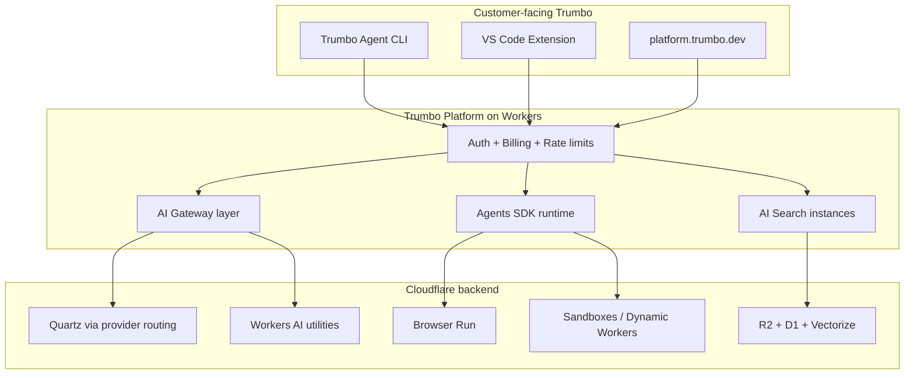

# Trumbo × Cloudflare Resell Roadmap

Internal strategy doc: how Trumbo can monetize Cloudflare’s AI and agent stack as **Trumbo-branded platform SKUs**, not raw Cloudflare resale.

Last updated: July 2026

---

## Executive summary

Cloudflare does **not** offer blanket white-label of its consumer products (dashboard, WARP, Browser Run UI, etc.). The highest-leverage path for Trumbo is **embedded infrastructure**: Trumbo-branded capabilities backed by Cloudflare, with markup and **server-side enforcement on `platform.trumbo.dev`**.

This matches the open-source CLI + paid platform model: customers buy Trumbo platform capabilities (requests, agent hours, knowledge storage, browser minutes), not Cloudflare units.

**Recommended posture:** build Trumbo SKUs on Cloudflare; join the Agency Program for COGS relief; pursue Alliance only when OEM contract terms or committed spend require it.

---

## What “white label” means with Cloudflare

| Model | What the customer sees | How you get there |
| --- | --- | --- |
| **Embedded infrastructure** | Only Trumbo (platform, agents, pricing) | Build on Workers / Agents SDK; Cloudflare is invisible backend |
| **Managed / resold Cloudflare** | Cloudflare-powered service under your MSP contract | PowerUP **Manage/Resell** or **Agency Program** + Tenant API |
| **Formal OEM white-label** | Deep integration; co-branding possible in contract | **Alliance tier** only (enterprise negotiation) |

For Trumbo, **embedded infrastructure** is the default. Reselling raw Cloudflare SKUs is low margin, weak differentiation, and misaligned with “Trumbo is a full-stack AI company” positioning.

---

## Cloudflare AI / agent product catalog

### Core inference and control plane

| Service | What it is | Trumbo resale fit |
| --- | --- | --- |
| [Workers AI](https://developers.cloudflare.com/workers-ai/) | Edge GPU inference (LLMs, embeddings, image, audio, rerankers) | **High** as backend for cheap/fast tasks (embeddings, guardrails, small models). Keep **Quartz** as flagship; Workers AI as overflow/specialty |
| [AI Gateway](https://developers.cloudflare.com/ai-gateway/) | Unified proxy: caching, fallbacks, rate limits, logs, guardrails, unified billing credits | **Very high**. Backbone for provider routing, tier caps, observability. Core is free; mark up platform access |
| [AI Search](https://developers.cloudflare.com/ai-search/) | Managed RAG: ingest, index, hybrid search, MCP per instance | **Very high** as **Trumbo Knowledge**. Customer never touches Cloudflare |
| [Vectorize](https://developers.cloudflare.com/vectorize/) | Global vector DB | **High** if custom RAG beyond AI Search |
| Guardrails (via AI Gateway + Workers AI) | Prompt/response safety filtering | **High** as Trumbo platform safety layer |

### Agent runtime and orchestration

| Service | What it is | Trumbo resale fit |
| --- | --- | --- |
| [Agents SDK](https://developers.cloudflare.com/agents/) | Stateful agents: SQLite, WebSockets, scheduling, email/Slack/voice/webhooks | **Very high** for **Trumbo Cloud Agents** |
| [Project Think](https://developers.cloudflare.com/agents/harnesses/think/) | Long-running multi-step agent harness | **High** for Max/Ultra “deep work” agents |
| [Workflows](https://developers.cloudflare.com/workflows/) | Durable multi-step jobs with retries | **High** for scheduled agents, CI-style automations |
| [Durable Objects](https://developers.cloudflare.com/durable-objects/) | Strongly consistent state + SQLite | **Very high** for session state, agent memory, hub patterns |
| [Dynamic Workers](https://developers.cloudflare.com/dynamic-workers/) | Millisecond isolate sandboxes for untrusted code | **Very high** for agent tool execution at scale |
| [Durable Object Facets](https://developers.cloudflare.com/dynamic-workers/usage/durable-object-facets/) | Per-agent isolated DB inside supervisor DO | **High** for multi-tenant agent platforms |
| [Code Mode](https://developers.cloudflare.com/agents/tools/codemode/) | Agent orchestrates tools via code | **Medium–high** as advanced agent capability |

### Agent tools (“the hands”)

| Service | What it is | Trumbo resale fit |
| --- | --- | --- |
| [Sandboxes](https://developers.cloudflare.com/agents/tools/sandbox/) | Persistent Linux VMs: shell, filesystem, background processes | **Very high** as **Trumbo Remote Shell / Cloud Dev Environment** (Paid+ plan) |
| [Browser Run](https://developers.cloudflare.com/browser-run/) | Headless Chrome for agents: CDP, live view, human-in-the-loop | **Very high** as Trumbo Agent browser tool backend |
| [Remote MCP](https://developers.cloudflare.com/agents/tools/mcp/) + OAuth | Host MCP servers agents can call | **Very high** as **Trumbo MCP Hosting** |
| Cloudflare MCP servers | Prebuilt MCP for AI Gateway, AI Search, DNS, etc. | **Medium** (internal; not a standalone customer SKU) |
| Agent payments tool | Payments inside agent flows | **Medium** if Trumbo adds usage billing / marketplace |

### Storage and data plane

| Service | What it is | Trumbo resale fit |
| --- | --- | --- |
| [R2](https://developers.cloudflare.com/r2/) | Object storage, zero egress | **Very high** for docs, uploads, artifacts |
| [D1](https://developers.cloudflare.com/d1/) | Serverless SQL | **Very high** (already used on platform + marketing) |
| [KV](https://developers.cloudflare.com/kv/) | Low-latency config/cache | **High** for rate limits, feature flags, session cache |
| [Queues](https://developers.cloudflare.com/queues/) | Async job processing | **High** for indexing, webhooks, agent job queues |
| [Hyperdrive](https://developers.cloudflare.com/hyperdrive/) | DB connection pooling to external Postgres | **Medium** if platform needs external DB |
| [Artifacts](https://www.cloudflare.com/agents-week/updates/) | Git-compatible versioned storage for agent code | **High** as **Trumbo Agent Repos** / checkpoint storage |

### Networking and security

| Service | What it is | Trumbo resale fit |
| --- | --- | --- |
| [Cloudflare Mesh](https://developers.cloudflare.com/cloudflare-one/networks/connectors/cloudflare-mesh/) | Zero-trust private networking for agents/sandboxes | **High** for enterprise “agent reaches internal VPC” SKU |
| [Workers VPC](https://developers.cloudflare.com/workers-vpc/) | Connect Workers to private networks | **High** with Mesh for enterprise Trumbo Agent |
| [Access](https://developers.cloudflare.com/cloudflare-one/policies/access/) | Identity-aware access | **Medium** for enterprise SSO-gated agents |
| [Turnstile](https://developers.cloudflare.com/turnstile/) | Bot protection | **Medium** for signup/abuse on platform |
| AI Audit | Detect/block AI crawlers on customer sites | **Medium** as add-on (“protect your docs from scraping”) |

### Adjacent developer platform

| Service | Role for Trumbo |
| --- | --- |
| Workers / Pages | Platform API, marketing, web app, agent endpoints |
| Workers Logs / Analytics | Usage dashboards, support, billing reconciliation |
| Email Routing / Email Workers | Agent email channel |
| Realtime SFU | Voice / multiplayer agent sessions |
| Stream / Images | Media-heavy agent features only |

---

## Recommended Trumbo SKUs (customer-facing)

### Tier 1: strongest fit (build first)

| SKU | Cloudflare backend | Customer value | Status |
| --- | --- | --- | --- |
| **Trumbo Knowledge** | AI Search + R2 | Per-team RAG; `search_knowledge` MCP tool | **Shipped** (platform, billing, marketing on `/agent`) |
| **Trumbo Cloud Agents** | Agents SDK + Durable Objects + Think | Hosted agents: memory, scheduling, Slack/email/webhooks | **Shipped** (Think DO + REST API + MCP tools + channels) |
| **Trumbo Inference Control Plane** | AI Gateway in front of Quartz + providers | Rate limits, logging, fallbacks, guardrails (server-side) | Partial (custom proxy today; Gateway migration later) |
| **Trumbo Browser** | Browser Run | Cloud browser tool for CLI, VS Code, platform | **Shipped** (Quick Actions API + stateful Agent Sessions with human-in-the-loop) |
| **Trumbo Sandbox** | Sandboxes + Dynamic Workers | Remote code execution without local `--yolo` shell | **Shipped** (Sandbox SDK DO + REST API + MCP tools) |

### Tier 2: enterprise upsell

| SKU | Cloudflare backend | Customer value |
| --- | --- | --- |
| **Trumbo Private Agent Connect** | Mesh + Workers VPC + Access | Agent reaches internal APIs without VPN |
| **Trumbo Agent Repos** | Artifacts + R2 | Git-compatible project storage, checkpoints, fork/clone |
| **Trumbo MCP Host** | Remote MCP + OAuth | Managed MCP servers per org/team |
| **Trumbo Automations** | Workflows + scheduled Agents SDK | Cron agents, PR bots, monitoring agents |

### Tier 3: supplement, not headline

| SKU | Cloudflare backend | Notes |
| --- | --- | --- |
| Trumbo Embeddings / utility models | Workers AI | Cheap edge tasks only |
| Trumbo Site Shield | AI Audit + Turnstile | Protect customer docs from scraping |
| Trumbo Vector DB | Vectorize | Custom retrieval beyond AI Search |

---

## Build priority (integration effort × sellability)

Ranked for **easiest to start selling** as a net-new Trumbo product:

| Priority | Product | Sellability | Integration effort | Verdict |
| --- | --- | --- | --- | --- |
| 1 | **Trumbo Knowledge** | High | Low–medium | **Ship first** (done) |
| 2 | **AI Gateway** (silent infra) | Low as named SKU | Medium | Background upgrade to existing chat proxy |
| 3 | **Trumbo Browser** | Medium | High | Visible agent superpower; Max/Ultra upsell |
| 4 | **Trumbo Cloud Agents** | High long-term | Very high | Platform moat; not first product |
| 5 | **Trumbo Sandbox** | Medium | Very high | Enterprise / no-local-shell segment |

**Do not launch** “Trumbo Inference Control Plane” as a separate named product today. Customers already pay for Quartz + platform access. AI Gateway improves margin and reliability; it is infrastructure, not a second SKU.

---

## Phased roadmap

### Phase 0 — Foundation (complete)

- [x] Platform on Cloudflare Workers (`platform.trumbo.dev`)
- [x] Server-side auth, org scoping, Pro/Max/Ultra rate limits
- [x] Quartz routing + usage tracking
- [x] MCP endpoint at `/v1/mcp`

### Phase 1 — Trumbo Knowledge (complete)

- [x] D1 schema: `knowledge_instances`, `knowledge_documents`, plan limits
- [x] Wrangler: `ai_search_namespaces` + R2 knowledge bucket
- [x] API: `/api/v1/knowledge` (upload, list, search, delete, reindex)
- [x] MCP: `search_knowledge` scoped to org
- [x] Platform UI: `/knowledge` page
- [x] Admin: per-plan Knowledge limits
- [x] Billing + marketing: feature on pricing and `/agent`

**Pitch:** “Trumbo Knowledge — your team’s docs, searchable by Trumbo Agent.”

### Phase 2 — Silent control plane (Q3 2026)

- [ ] Route platform inference through **AI Gateway** (caching, fallbacks, unified logs)
- [ ] Add Guardrails policies per tier (Pro vs Max vs Ultra)
- [ ] Reconcile Cloudflare meters with Trumbo usage tables for margin analysis
- [ ] Join **Cloudflare Agency Program** (20% self-serve discount)

**Outcome:** Better margins and reliability without changing customer-facing SKUs.

### Phase 3 — Trumbo Browser (Q4 2026)

Trumbo Browser Run ships in two layers:

**Browser Run API SKU** (shipped — stateless Quick Actions):
- [x] Browser Run binding on platform Worker
- [x] REST API `/api/v1/browser/*` (10 endpoints: screenshot, markdown, content, pdf, scrape, json, links, accessibility-tree, snapshot, crawl)
- [x] MCP tools: `browser_screenshot`, `browser_markdown`, `browser_content`, `browser_pdf`
- [x] Subscription gating for in-agent MCP (monthly minutes) + credit billing for standalone REST
- [x] Plan limits in D1 + admin UI; `/browser` usage dashboard
- [x] Marketing + pricing copy

**Browser Run Agent Sessions** (shipped — interactive cloud browser):
- [x] `BrowserSession` Durable Object (first DO in the project) holding a live CDP session per `scope:sessionId`
- [x] Stateful `browser_session_*` MCP tools: launch, navigate, click, type, scroll, screenshot, close, handoff, wait
- [x] Concurrent-session enforcement (the `sessions_used` counter is now actually incremented/decremented; was display-only before)
- [x] Monthly-minute + concurrent gates on launch, server-side (open-source CLI cannot bypass)
- [x] Keepalive alarm (9-min ping) so sessions survive long agent turns
- [x] Human-in-the-loop: `browser_session_handoff` returns a Live View URL (`live.browser.run`); `browser_session_wait` polls until the human navigates or a 5-min timeout fires
- [x] Works uniformly in CLI + VS Code via the existing platform MCP auto-sync (no client changes for tool discovery)

**Pitch:** “Browse the web from Trumbo Agent without leaving your workflow.”

**Remaining (follow-up, not blocking):**
- [ ] Surface active sessions + Live View URLs on the `/browser` dashboard page
- [ ] Wire VS Code `BrowserSessionRow.tsx` to render `browser_session_*` MCP tool calls (translator work, no new tool — the `BrowserActionResult` shape is already preserved)
- [ ] Apply for Cloudflare Agency Program (COGS relief on browser-hours + concurrency fees)
- [ ] Add MCP parity for the remaining 6 Quick Action endpoints (scrape, json, links, accessibility-tree, snapshot, crawl) as stateless `browser_*` tools

### Phase 4 — Trumbo Cloud Agents (shipped July 2026)

- [x] Think harness on Durable Objects (TrumboAgent extends Think, one DO per agent session)
- [x] WebSocket client via AgentClient (wss://platform.trumbo.dev/agents/TrumboAgent/{sessionId})
- [x] REST API at /api/v1/agents (create, list, get, send message, stop, delete)
- [x] MCP tools: agent_create, agent_send_message, agent_get_state, agent_stop, agent_list, agent_delete
- [x] Channel connectors: Slack, email, webhook, voice (tier-gated)
- [x] Channel management API + MCP tools (agent_add_channel, agent_list_channels, agent_remove_channel)
- [x] Webhook receivers at /api/v1/channels (Slack Events API, generic webhook, email)
- [x] Tier limits: concurrent agents + monthly agent-hours (server-side enforced)
- [x] Billing: pre-charge on launch, settle on delete, dead-agent cleanup
- [x] /me/plan exposes agents usage block to CLI + VS Code

**Pitch:** "Run agents in the cloud with memory, schedules, and team channels."

**Remaining (follow-up):**
- [ ] VS Code rich UI: CloudAgentSessionRow + CloudAgentPanel + CloudAgentController bridge
- [ ] Voice channel via Cloudflare Realtime SFU + Workers AI speech-to-text/text-to-speech (Ultra only)
- [ ] Email channel via Cloudflare Email Routing (MX record for agents.trumbo.dev)

### Phase 5 — Trumbo Sandbox (shipped July 2026)

- [x] Sandbox SDK (@cloudflare/sandbox) Durable Object for remote Linux VM code execution
- [x] REST API at /api/v1/sandbox (create, exec, run-code, files, tunnels, destroy)
- [x] MCP tools: sandbox_create, sandbox_exec, sandbox_run_code, sandbox_write_file, sandbox_read_file, sandbox_list_files, sandbox_destroy
- [x] Tier limits: concurrent sandboxes + monthly CPU-seconds (server-side enforced)
- [x] Billing: pre-charge on create, settle on destroy, dead-sandbox cleanup
- [x] Egress control: internet off by default, configurable allowlist
- [x] /me/plan exposes sandbox usage block to CLI + VS Code

**Pitch:** "Execute code in Trumbo's cloud when local shell is not an option."

**Remaining (follow-up):**
- [ ] Container image build (requires Docker on deploy machine — currently deployed without the container image; the DO + binding + REST API + MCP tools are live)

### Phase 6 — Enterprise SKUs (2027+)

- [ ] Trumbo Private Agent Connect (Mesh + VPC + Access)
- [ ] Trumbo MCP Host (customer MCP servers with OAuth)
- [ ] Trumbo Agent Repos (Artifacts + R2)
- [ ] Trumbo Automations (Workflows + cron)
- [ ] Alliance conversation if OEM terms or committed spend justify it

---

## Partner programs (billing / resale mechanics)

### Self-Serve Agency Program (easiest entry)

- **20% discount** on self-serve products (not Registrar)
- Multi-tenant dashboard + **Tenant API** for provisioning customer accounts
- Covers zone plans and Workers subscriptions
- **No formal white-label**; customer may still see Cloudflare in some provisioning flows
- Contact: `agency@cloudflare.com`

### PowerUP (Resell / Manage / Distribute / Consult)

- **Manage:** you own the customer relationship, operate Cloudflare for them
- **Resell:** integrate and sell Cloudflare into solutions
- Stronger fit for security/CDN/Zero Trust than pure AI branding

### Alliance (real OEM white-label)

- Includes white-labeling solutions into partner applications
- Enterprise OEM/platform partners only
- Custom contracts + dedicated account team
- Pursue when Trumbo needs contractual OEM terms or large committed spend

---

## What not to white-label

- **WARP / Zero Trust client** — no co-branding today
- **Cloudflare dashboard** — Tenant API customers may still hit Cloudflare UX
- **Workers AI catalog as “Trumbo models”** — keep **Quartz** as hero; Cloudflare as infrastructure
- **Pass-through reselling raw Cloudflare SKUs** — weak differentiation and margin

Public marketing must not mention backend hosting providers by name. Position Trumbo-owned products (Quartz, Knowledge, Agent) only.

---

## Target architecture

---

## Billing rules (exploit-proof)

Because the CLI and VS Code extension are open source:

1. **All entitlements enforced on `platform.trumbo.dev`** (never trust client-only checks).
2. **Sell Trumbo units**, not Cloudflare units: requests, knowledge docs/storage/searches, browser minutes, sandbox CPU-seconds.
3. **Per-org / per-team scoping** for Knowledge, MCP, and future hosted agents.
4. **Admin-configurable plan limits** in D1; Stripe/Polar webhooks update subscription state server-side.
5. **No free tier** for platform Knowledge or hosted runtime; Pro+ only.

---

## Practical next steps

1. **Operationalize Knowledge** — monitor AI Search instance provisioning, failed index retries, tier limit alerts.
2. **Apply for Agency Program** — reduce COGS on Workers AI, Browser Run, Sandboxes as usage grows.
3. **Spec AI Gateway migration** — document which routes move first (`/api/v1/chat`, `/api/v1/ai`).
4. **Draft Browser Run spike** — one Worker route + one MCP tool proof of concept.
5. **Keep Quartz as hero model** — Cloudflare powers agent hosting, RAG, tools, and control plane, not the brand story.

---

## References

- [Cloudflare AI solutions](https://www.cloudflare.com/solutions/ai/)
- [AI Search Workers binding](https://developers.cloudflare.com/ai-search/api/instances/workers-binding/)
- [Agents SDK](https://developers.cloudflare.com/agents/)
- [AI Gateway](https://developers.cloudflare.com/ai-gateway/)
- [Cloudflare Tenant API](https://developers.cloudflare.com/tenant/)
- Trumbo platform: `cline-full/projects/web`
- Trumbo Knowledge implementation: migration `0009_knowledge.sql`, routes `/api/v1/knowledge`, `/v1/mcp`
