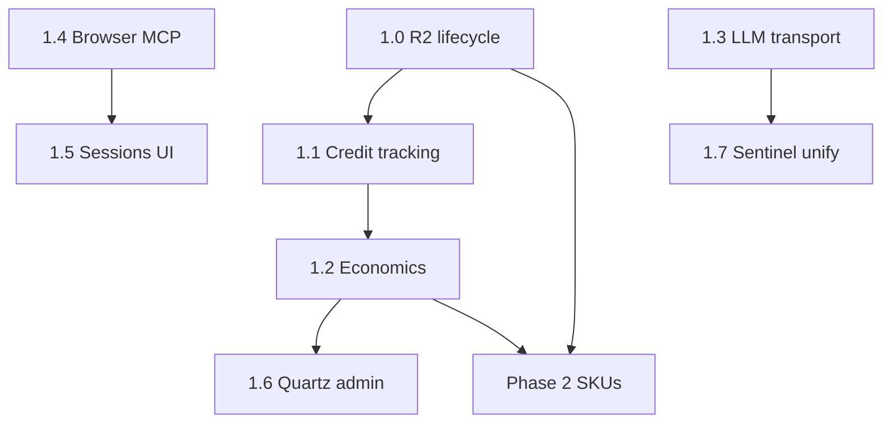

# Trumbo Platform — Technical Roadmap (Cloudflare Startup)

Engineering build plan for `projects/web` (`trumbo-web` Worker). **Credit pool: $10,000** (invoice-tracked). Complements [`cloudflare-resell-roadmap.md`](./cloudflare-resell-roadmap.md).

Last updated: July 26, 2026

---

## Implementation timeline (single engineer)

| Week | Deliverable | Migrations | Primary files |
| --- | --- | --- | --- |
| **1** | R2 lifecycle + startup credit Admin | `0049_startup_credits.sql` | `lib/r2-lifecycle.ts`, `lib/sandbox-backups.ts`, `lib/knowledge.ts`, `index.ts` (cron), `routes/admin.ts`, `pages/Admin.tsx` |
| **1** | Browser MCP parity (6 tools) | — | `routes/mcp.ts`, `lib/browser-billing.ts` |
| **2** | Browser session registry + Live View UI | `0051_browser_session_registry.sql` | `do/browser-session.ts`, `routes/browser.ts`, `pages/Browser.tsx`, `lib/api.ts` |
| **2–3** | Unit economics + Admin runway | `0050_unit_economics.sql` | `lib/usage-reconciliation.ts`, `lib/quartz-cost-basis.ts`, `lib/cf-unit-costs.ts`, `pages/Admin.tsx` |
| **3** | Quartz admin console | — | `routes/admin.ts`, `lib/quartz-router.ts`, `pages/Admin.tsx` |
| **4** | Sentinel → shared LLM transport (optional) | — | `lib/sentinel/sentinel-llm.ts`, `lib/fireworks.ts` |
| **5+** | Agent schedules / email / DAST | `0052_agent_schedules.sql`, wrangler queues | Only if invoice runway healthy |
| **Defer** | AI Gateway, Workers AI, Workflows, MCP Host | — | Post-$10k or revenue-covered |

**Agency Program (ops):** apply at ~**$5,000 consumed** (~50% of pool).



---

## Constraints

| Constraint | Engineering implication |
| --- | --- |
| **Startup credits** | **$10,000** / 1 year — R2 program cap equals entire pool; invoice-only visibility |
| **Credits invoice-only** | No CF dashboard API for balance; build invoice-driven Admin tracking |
| **R2 sub-cap $10k** | **Critical:** R2 can consume 100% of $10k pool — lifecycle week 1 |
| **Workers AI sub-cap $50k** | Moot at $10k pool; defer utility lane |
| **AI Gateway excluded** | `llm-gateway.ts` defaults to Fireworks; Gateway opt-in = card billing |
| **Open-source clients** | All entitlements enforced server-side on `platform.trumbo.dev` |

---

## Architecture baseline (shipped)

```
api.trumbo.dev / platform.trumbo.dev
└── trumbo-web (Worker: src/server/index.ts)
    ├── Hono API (src/server/api-app.ts)
    ├── D1 (DB) — 48 migrations, org-scoped tenancy
    ├── R2 — KNOWLEDGE_R2, BACKUP_BUCKET
    ├── AI_SEARCH — per-org Knowledge instances
    ├── BROWSER — Browser Run Quick Actions
    ├── DOs — BrowserSession, TrumboAgent, Sandbox, SecurityScanner, RuntimeScanner
    ├── Containers — trumbo-web-sandbox (max 50)
    ├── Queues — security-scan-jobs, security-remediation-jobs (+ DLQ)
    └── Cron — */15 * * * * (security schedules, sandbox eviction)
```

**Shipped SKUs:** Knowledge, Browser (REST + MCP sessions), Cloud Agents, Sandbox, Security (Sentinel).

**Inference today:** `lib/fireworks.ts` → Fireworks direct; `lib/quartz-router.ts` for turn routing.

**Not wired:** AI Gateway, Workers AI binding, CF Workflows, Email Routing, KV, Vectorize, Tenant API, `SECURITY_DAST_QUEUE` producer/consumer.

---

## Phase 1 — Instrumentation & SKU polish (Weeks 1–4)

Goal: Protect the $10k pool, instrument burn rate, complete Browser MCP/dashboard. **R2 lifecycle is week-1 priority.**

### 1.0 R2 lifecycle & cap guardrails (move from Phase 2)

**Problem:** At $10k total credits, the program R2 cap ($10k) equals your **entire pool**. Knowledge + sandbox backups can zero credits silently.

**Build:**

| Layer | Work |
| --- | --- |
| **Server** `lib/r2-lifecycle.ts` | List `BACKUP_BUCKET` + `KNOWLEDGE_R2` by prefix; delete objects older than TTL; log deletions to D1 `r2_lifecycle_log` |
| **Server** `lib/sandbox-backups.ts` | Enforce tier cap (exists); add global max age eviction in `evictOldestBackups` path |
| **Server** `lib/sandbox-cleanup.ts` | Extend `cleanupStaleSandboxes` to drop backup handles when sandbox destroyed |
| **Server** `lib/knowledge.ts` | `getOrgStorageBytes()`; reject upload when over plan soft limit |
| **Migration** `0049_startup_credits.sql` | Include `r2_lifecycle_log`; settings: `r2_backup_ttl_days` (default 21), `knowledge_max_bytes_per_org` |
| **Cron** `index.ts` | Weekly: `runR2Lifecycle(env)` (new handler alongside sandbox cleanup) |
| **Admin** | R2 estimated burn as % of $10k on Startup credits tab (§1.1) |

**Acceptance:**

- Automated backup TTL (e.g. 14–30 days)
- Admin alert when estimated R2 spend >20% of remaining credits

**Effort:** M | **Priority:** Week 1

---

### 1.1 Startup credit tracking (Admin)

**Problem:** Tier 1 credits deduct automatically but balance appears only on monthly invoices.

**Build:**

| Layer | Work |
| --- | --- |
| **Migration** `0049_startup_credits.sql` | `startup_credit_snapshots` (id, recorded_at, balance_usd, r2_used_usd, wai_used_usd, notes, invoice_ref); `app_settings` keys for `startup_credit_balance`, `startup_credit_expires_at`, `startup_r2_cap_usd` (10000), `startup_wai_cap_usd` (50000) |
| **Server** `lib/startup-credits.ts` | CRUD snapshots; compute runway days from last two snapshots; sub-cap percent helpers |
| **Routes** `routes/admin.ts` | `GET/POST /api/v1/admin/startup-credits`, `GET /api/v1/admin/startup-credits/runway` |
| **UI** `pages/Admin.tsx` | “Startup credits” tab: balance input, expiry, R2/WAI progress bars, snapshot history, invoice note |

**Acceptance:**

- Admin records balance after each invoice
- Runway estimate when ≥2 snapshots exist
- Warning when R2 ≥80% of $10k or Workers AI ≥80% of $50k

**Effort:** M | **Depends:** First invoice baseline

---

### 1.2 Unit economics & reconciliation

**Problem:** Usage split across `usage_events`, `credit_ledger`, `browser_usage_counters`, `agent_usage_counters`, `sandbox_usage_counters`; no COGS view.

**Build:**

| Layer | Work |
| --- | --- |
| **Migration** `0050_unit_economics.sql` | `cf_unit_costs` (product, unit, cost_usd_per_unit, effective_from); extend `quartz_routing_decisions` with `estimated_cost_usd` if missing |
| **Server** `lib/quartz-cost-basis.ts` | Fireworks token → USD from admin rates |
| **Server** `lib/cf-unit-costs.ts` | Seed: browser_minute, sandbox_cpu_ms, agent_hour, ai_search_query |
| **Server** `lib/usage-reconciliation.ts` | Aggregate Trumbo revenue (credits × $0.001 + subscription proration) vs estimated CF COGS by product |
| **Routes** `routes/admin.ts` or `routes/usage-reconciliation.ts` | `GET /api/v1/admin/economics?range=7d\|30d\|90d` |
| **UI** `pages/Admin.tsx` | Economics tab: revenue, COGS, margin %, credit runway overlay |

**Acceptance:**

- Breakdown: chat, browser, agents, sandbox, security, knowledge
- Chat margin uses `estimated_cost_usd` on settled routing decisions
- Export JSON for ops review

**Effort:** L | **Depends:** 1.1 for runway overlay

---

### 1.3 LLM transport abstraction — **DEFER at $10k pool**

Cash-only AI Gateway; low ROI until credits exhaust or revenue covers card. When built:

| Layer | Work |
| --- | --- |
| **Server** `lib/llm-gateway.ts` | `LlmTransport`; `FireworksTransport`, `AiGatewayTransport` |
| **Server** `lib/fireworks.ts` | Delegate `proxyChatCompletions` to transport |
| **Settings** | `llm_transport` in D1; default `fireworks` |

**Effort:** M | **Status:** Deferred until post-credits or explicit reliability need

---

### 1.4 Browser MCP parity (6 Quick Actions)

**Problem:** REST `/api/v1/browser/*` has 10 endpoints; MCP exposes 4 stateless tools.

**Build:**

| Layer | Work |
| --- | --- |
| **Routes** `routes/mcp.ts` | Add tools: `browser_scrape`, `browser_json`, `browser_links`, `browser_accessibility_tree`, `browser_snapshot`, `browser_crawl` |
| **Mapping** | Extend `BROWSER_TOOL_ENDPOINTS`; reuse `handleBrowserTool` → `lib/browser.ts` |
| **Billing** | Existing `preChargeBrowserCall` / `settleBrowserCall` with `source: mcp` |

**Acceptance:**

- `tools/list` parity with REST Quick Actions
- Same billing and plan gates as existing browser MCP tools

**Effort:** M | **Depends:** None

---

### 1.5 Browser session registry + Live View dashboard

**Problem:** `BrowserSession` DO holds Live View URLs; `/browser` has no active session list.

**Build:**

| Layer | Work |
| --- | --- |
| **Migration** `0051_browser_session_registry.sql` | `browser_session_registry` (id, scope_type, scope_id, session_id, status, url, live_view_url, started_at, ended_at, source) |
| **DO** `do/browser-session.ts` | Write-through on launch, handoff, close, idle eviction |
| **Routes** `routes/browser.ts` | `GET /api/v1/browser/sessions` (active + recent for org scope) |
| **UI** `pages/Browser.tsx` | “Active sessions” table; Open Live View; refresh interval |
| **API client** `lib/api.ts` | Types + fetch helpers |

**Acceptance:**

- Org-scoped list matches DO reality within 30s
- Handoff updates `live_view_url` in registry
- Concurrent session count still enforced server-side

**Effort:** L | **Depends:** Migration before dashboard

---

### 1.6 Admin Quartz routing console

**Problem:** Tier policy API exists in `routes/admin.ts`; `quartz_task_policy` table has no CRUD API/UI.

**Build:**

| Layer | Work |
| --- | --- |
| **Routes** `routes/admin.ts` | Task policy CRUD mirroring tier policy |
| **Server** `lib/quartz-router.ts` | Export `listQuartzTaskPolicy`, validation |
| **UI** `pages/Admin.tsx` | Quartz tab: tier + task-type → model matrix; sample recent `quartz_routing_decisions` |

**Acceptance:**

- Admin edits apply on next `routeQuartzTurn`
- Read-only last 50 decisions with tokens + cost

**Effort:** L | **Depends:** 1.2 for cost column

---

### 1.7 Sentinel LLM unification (optional)

**Problem:** `sentinel-llm.ts` raw-fetches Fireworks; duplicate client vs `lib/fireworks.ts`.

**Build:** Replace `fetch("https://api.fireworks.ai/...")` with `proxyChatCompletions()` — **not** full `handleChatCompletion()` (keep Sentinel retries, JSON continuation, `TokenAccumulator` → scan credits).

| File | Change |
| --- | --- |
| `lib/sentinel/sentinel-llm.ts` | `callFireworks()` → `proxyChatCompletions()` |
| `lib/security-agent-runner.ts` | Same pattern if still direct Fireworks |

**Acceptance:** No raw Fireworks URL in sentinel modules; scan credit billing unchanged.

**Effort:** M | **Depends:** None (does not require 1.3 Gateway)

---

## Phase 2 — Selective expansion (Weeks 5–10)

Goal: Ship high-value SKUs only where revenue justifies burn. **Defer Workers AI utilities and Workflows** at $10k pool. R2 lifecycle already shipped in Phase 1.

### 2.1 Agent automation schedules

**Pattern:** Mirror `lib/security-scheduled.ts` + `security-scan-queue.ts`.

**Build:**

| Layer | Work |
| --- | --- |
| **Migration** `0052_agent_schedules.sql` | `agent_schedules` (id, org_id, agent_id, cron, prompt, timezone, enabled, last_run_at, next_run_at) |
| **Wrangler** | `agent-schedule-jobs` queue + consumer in `index.ts` |
| **Server** `lib/agent-scheduled.ts` | Cron handler extension: enqueue due schedules |
| **Server** `lib/agent-schedule-queue.ts` | Consumer: resolve agent DO, `sendMessage`, billing pre-charge |
| **Routes** `routes/agents.ts` | `POST/GET/DELETE /api/v1/agents/:id/schedules` |
| **MCP** | `agent_create_schedule`, `agent_list_schedules`, `agent_delete_schedule` |
| **UI** | Agent detail schedule panel (optional v1: API-only) |

**Acceptance:**

- Cron fires; agent receives prompt; billed via `agent-billing.ts`
- Max schedules per tier in D1 plan limits

**Effort:** L | **CF burn:** DO + Queues

---

### 2.2 Cloudflare Email Routing (inbound)

**Build:**

| Layer | Work |
| --- | --- |
| **Wrangler** | Email Worker route / `send_email` handler binding per CF docs |
| **Server** `email-inbound.ts` | Parse MIME → `{ from, subject, text }`; route to `channels.ts` logic |
| **DNS** | MX for `agents.trumbo.dev` (or subdomain) |
| **Routes** `routes/channels.ts` | Shared `forwardEmailToAgent(agentId, payload)` |
| **UI** | Channel setup: MX records + allowlist instructions |

**Acceptance:**

- `agent+{id}@agents.trumbo.dev` delivers to agent DO
- Allowlist enforced; Max+ tier gate

**Effort:** L | **CF burn:** Email Workers (usually low)

---

### 2.3 Agent email outbound

**Build:**

| Layer | Work |
| --- | --- |
| **Server** `lib/email-outbound.ts` | Resend or SendGrid adapter (env secret) |
| **DO** `do/trumbo-agent.ts` | On assistant reply when email channel active, call outbound |
| **Settings** | `email_outbound_provider`, API key encrypted in D1 |

**Acceptance:**

- Reply-To threading; tier gate server-side
- **Cash COGS** (ESP), not Startup credits

**Effort:** M | **Depends:** 2.2

---

### 2.4 Workers AI utility lane — **DEFER at $10k pool**

Skip until credits replenished or revenue covers cash. If built later: `[ai]` binding, embeddings/guardrails only.

**Effort:** M | **Status:** Deferred

---

### 2.5 R2 lifecycle — **shipped in Phase 1.0**

See §1.0. Do not wait for Phase 2.

---

### 2.6 SECURITY_DAST_QUEUE production wiring

**Build:**

| Layer | Work |
| --- | --- |
| **Wrangler** | Producer + consumer for `security-dast-jobs` |
| **Server** `lib/security-dast-queue.ts` | Mirror scan queue pattern |
| **Pipeline** `lib/sentinel/sentinel-dast-pipeline.ts` | Enqueue instead of inline long work |

**Acceptance:**

- HTTP 202 + job id; consumer runs DAST in Sandbox DO

**Effort:** M | **CF burn:** Queues + Sandbox

---

### 2.7 Browser endpoint analytics

**Build:**

| Layer | Work |
| --- | --- |
| **Billing** `lib/browser-billing.ts` | Tag `credit_ledger.reference` with endpoint name |
| **Stats** `lib/browser-stats.ts` | Group by endpoint + source (mcp \| api) |
| **UI** `pages/Browser.tsx`, `BrowserActivityChart.tsx` | Endpoint breakdown chart |

**Effort:** S

---

### 2.8 MCP scoped API tokens (optional)

**Build:**

| Layer | Work |
| --- | --- |
| **Auth** `routes/mcp.ts` | Accept API keys with scope `mcp:tools` when feature enabled |
| **Users** `routes/users.ts` | Scope on token creation |
| **Rate limits** | Same subscription gates as session Bearer |

**Effort:** M | **Product decision**

---

## Phase 3 — Platform expansion (Q1 2027+)

Goal: Durable automations product, MCP hosting, post-credit ops. Start only after Phase 1–2 exit criteria.

### 3.1 Trumbo Automations (Cloudflare Workflows)

| Layer | Work |
| --- | --- |
| **Wrangler** | Workflows binding + workflow definitions |
| **Migration** | `workflows`, `workflow_runs` tables |
| **Server** `lib/workflows/` | Define steps: call agent, sandbox exec, security scan, notify Slack |
| **Routes** | `/api/v1/workflows` CRUD + trigger |
| **Templates** | Scheduled security scan → Slack; cron agent with retries |

**CF burn:** Workflows + Workers (general pool)

**Effort:** XL

---

### 3.2 Trumbo MCP Host

| Layer | Work |
| --- | --- |
| **Migration** | `mcp_server_registry` (org_id, name, url, auth_type, encrypted_secret) |
| **Routes** `routes/mcp-host.ts` | Register/list/delete remote MCP servers |
| **Runtime** | Proxy `tools/list` merge with platform MCP |
| **OAuth** | MCP client OAuth (RFC) for third-party servers |

**Effort:** XL | **Depends:** 2.8

---

### 3.3 AI Gateway observability sync

| Layer | Work |
| --- | --- |
| **Server** `lib/cf-analytics-sync.ts` | GraphQL pull Gateway metrics (when used) |
| **Admin** | Drift report vs `usage_events` |

**Effort:** L | **Only if Gateway enabled (cash)**

---

### 3.4 Voice channel (Ultra)

| Layer | Work |
| --- | --- |
| **Wrangler** | Realtime SFU binding (when available) |
| **Workers AI** | STT/TTS utilities |
| **DO** `trumbo-agent.ts` | Voice channel type; WebSocket bridge |
| **Tier** | Ultra-only in `agent-enforcement.ts` |

**Effort:** XL

---

### 3.5 Private Agent Connect (enterprise)

| Layer | Work |
| --- | --- |
| **CF** | Mesh + Workers VPC + Access policies per customer |
| **Platform** | Entitlement flag; tunnel config UI |
| **Sales-led** | Pilot one design partner |

**Effort:** XL | **Often outside Startup credits**

---

### 3.6 Agency Program (ops, T-90)

No code. Apply at `agency@cloudflare.com` before credits exhaust for 20% post-credit discount.

---

## wrangler.toml delta (cumulative)

```toml
# Phase 2
[[queues.producers]]
binding = "AGENT_SCHEDULE_QUEUE"
queue = "agent-schedule-jobs"

[[queues.consumers]]
queue = "agent-schedule-jobs"
# ... mirror security-scan-jobs

[[queues.producers]]
binding = "SECURITY_DAST_QUEUE"
queue = "security-dast-jobs"

[[queues.consumers]]
queue = "security-dast-jobs"

# Phase 2 — Workers AI utilities
[ai]
binding = "AI"

# Phase 3 — Workflows (when ready)
# [[workflows]]
# binding = "AUTOMATIONS"
# name = "trumbo-automations"
# class_name = "TrumboWorkflow"
```

---

## D1 migration sequence

| # | File | Phase |
| --- | --- | --- |
| 0049 | `startup_credits.sql` + `r2_lifecycle_log` | 1.0 + 1.1 |
| 0050 | `unit_economics.sql` | 1.2 |
| 0051 | `browser_session_registry.sql` | 1.5 |
| 0052 | `agent_schedules.sql` | 2.1 |
| 0053 | `mcp_server_registry.sql` | 3.2 |
| 0054 | `workflows.sql` | 3.1 |

---

## API surface (new endpoints)

| Method | Path | Phase | Auth |
| --- | --- | --- | --- |
| GET/POST | `/api/v1/admin/startup-credits` | 1.1 | Admin |
| GET | `/api/v1/admin/startup-credits/runway` | 1.1 | Admin |
| GET | `/api/v1/admin/economics` | 1.2 | Admin |
| GET/PUT | `/api/v1/admin/cf-unit-costs` | 1.2 | Admin |
| GET | `/api/v1/browser/sessions` | 1.5 | User + org scope |
| GET/PUT | `/api/v1/admin/quartz/task-policy` | 1.6 | Admin |
| POST/GET/DELETE | `/api/v1/agents/:id/schedules` | 2.1 | User + org |
| POST/GET/DELETE | `/api/v1/workflows` | 3.1 | User + org |
| POST/GET/DELETE | `/api/v1/mcp-host/servers` | 3.2 | User + org |

---

## MCP tools (new)

| Tool | Phase |
| --- | --- |
| `browser_scrape`, `browser_json`, `browser_links`, `browser_accessibility_tree`, `browser_snapshot`, `browser_crawl` | 1.4 |
| `agent_create_schedule`, `agent_list_schedules`, `agent_delete_schedule` | 2.1 |

---

## Frontend pages (delta)

| Page | Phase | Work |
| --- | --- | --- |
| `Admin.tsx` | 1.1–1.2 | Startup credits, Economics, Quartz console |
| `Browser.tsx` | 1.5, 2.7 | Active sessions, endpoint charts |
| `Agents.tsx` (or detail) | 2.1 | Schedule CRUD |
| `Workflows.tsx` (new) | 3.1 | Automation builder (v1: list + trigger) |
| `McpHost.tsx` (new) | 3.2 | Registered servers |

---

## Phase exit criteria

### Phase 1 done when

- [ ] R2 lifecycle cron + backup TTL live; upload limits enforced
- [ ] Invoice-driven $10k balance + runway in Admin
- [ ] Economics API returns margin by product
- [ ] MCP browser tools = REST Quick Actions
- [ ] `/browser` shows Live View sessions
- [ ] Quartz admin console live

### Phase 2 done when (gate on healthy runway)

- [ ] Agent schedules run via queue + cron **OR** explicitly deferred
- [ ] Inbound email via Email Routing **OR** deferred
- [ ] DAST queue wired **OR** deferred
- [ ] Browser endpoint analytics live
- [ ] Agency applied at ~$5k consumed

### Phase 3 done when

- [ ] Workflows / MCP Host in production **OR** deferred with reason
- [ ] Post-credit plan limits validated against unit cost table

---

## Explicitly out of scope

- Cloudflare Tenant API / per-customer CF accounts
- Pass-through Cloudflare SKU resale
- Workers AI as Quartz replacement
- Standalone KV / Vectorize customer products
- Replacing Pro/Max/Ultra with credit-only tiers
- AI Gateway as default transport (cash + not credit-eligible)

---

## Suggested build order (single engineer, $10k pool)

```
Week 1:  1.0 R2 lifecycle → 1.1 credit tracking → 1.4 MCP browser tools
Week 2:  1.5 browser sessions + 1.2 economics (start)
Week 3:  1.2 economics → 1.6 Quartz admin
Week 4:  1.7 Sentinel transport unification (optional if time)
Week 5+: 2.1 schedules OR 2.2 email — only if invoice runway >6 months at current burn
Defer:   2.4 Workers AI, 3.1 Workflows, 1.3 AI Gateway (cash)
Agency:  at ~$5k consumed (~50%)
```

---

## Shipped vs build next

| Area | Status | Location |
| --- | --- | --- |
| Knowledge (AI Search + R2) | Shipped | `routes/knowledge.ts`, `lib/knowledge.ts` |
| Browser REST + MCP sessions | Shipped | `routes/browser.ts`, `do/browser-session.ts`, `routes/mcp.ts` |
| Cloud Agents (Think DO) | Shipped | `do/trumbo-agent.ts`, `routes/agents.ts` |
| Sandbox + Containers | Shipped | `routes/sandbox.ts`, `Dockerfile.sandbox` |
| Security + Queues | Shipped | `do/security-scanner.ts`, `lib/security-scan-queue.ts` |
| R2 lifecycle | **Build week 1** | `lib/r2-lifecycle.ts` (new) |
| Credit runway Admin | **Build week 1** | `0049_startup_credits.sql` |
| Browser MCP ×6 | **Build week 1** | `routes/mcp.ts` |
| Session registry / Live View | **Build week 2** | `0051_*.sql`, `Browser.tsx` |
| Economics dashboard | **Build week 2–3** | `0050_*.sql` |
| Agent schedules | Deferred | Phase 2 |
| Email Routing | Deferred | Phase 2 |
| AI Gateway / Workers AI / Workflows | Deferred | Post-$10k |

---

## References

- Platform Worker: `projects/web/`
- Bindings: `projects/web/wrangler.toml`, `src/server/lib/env.ts`
- Strategy: `docs/cloudflare-resell-roadmap.md`
- Interactive checklist: Cursor canvas `cloudflare-next-steps.canvas.tsx`
