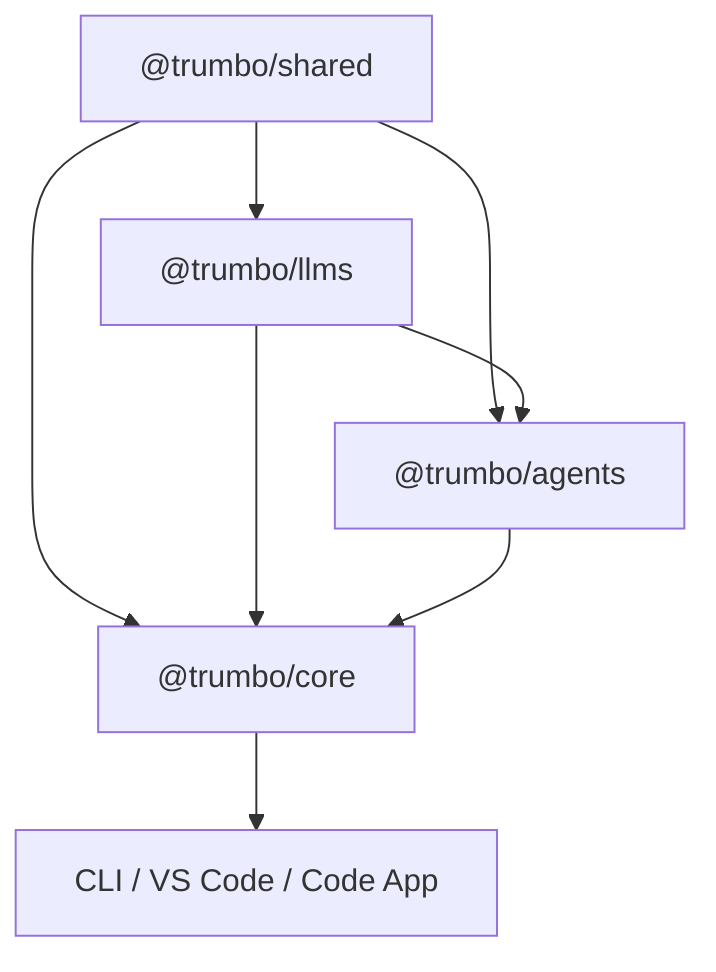

```text
████████╗██████╗ ██╗   ██╗███╗   ███╗██████╗  ██████╗ 
╚══██╔══╝██╔══██╗██║   ██║████╗ ████║██╔══██╗██╔═══██╗
   ██║   ██████╔╝██║   ██║██╔████╔██║██████╔╝██║   ██║
   ██║   ██╔══██╗██║   ██║██║╚██╔██║██╔══██╗██║   ██║
   ██║   ██║  ██║╚██████╔╝██║ ╚═╝ ██║██████╔╝╚██████╔╝
   ╚═╝   ╚═╝  ╚═╝ ╚═════╝ ╚═╝     ╚═╝╚═════╝  ╚═════╝ 
```


# Trumbo SDK — Development Reference

A quick-reference for active development. For onboarding, workspace setup, publishing, and detailed workflow, see [CONTRIBUTING.md](./CONTRIBUTING.md). For architecture and runtime flows, see [ARCHITECTURE.md](./ARCHITECTURE.md). For API details, see [DOC.md](./DOC.md).

## Repository Scope

This file applies to the SDK workspace rooted at this directory (`engine/`). Throughout this repo, "root" means the SDK workspace root unless explicitly stated otherwise. Ignore the legacy repository root for SDK work, except for Git operations or repo-wide searches that are explicitly needed.

Run SDK commands from `engine/`, not from the legacy repository root. Avoid direct root-level invocations such as `bun test engine/...`; they bypass SDK workspace setup and can fail to resolve `workspace:*` packages correctly.

## Package Boundaries

### Published SDK Packages

- `@trumbo/shared`: shared contracts, schemas, path helpers, hook engine, extension registry, and low-level utilities
- `@trumbo/llms`: provider settings/config, model catalogs, provider manifests, gateway contracts, and handler creation
- `@trumbo/agents`: stateless agent loop, tool orchestration, hook/extension runtime, and event streaming
- `@trumbo/core`: stateful orchestration, session lifecycle, storage, config watching, plugin loading, default tools, and telemetry. Exposes `@trumbo/core/hub` for discovery, the detached daemon entry, WebSocket clients, and session/UI client adapters, plus `@trumbo/core/hub/daemon-entry` for launching the shared daemon

### Dependency Direction



Rules:

- `shared` stays low-level and reusable
- `agents` stays stateless — no session, storage, or config concerns
- `core` owns stateful orchestration, including the shared-hub daemon, server, and client adapters under `src/hub/`

## Change Routing

Route every change to the package that owns the concern:

- model/provider schemas or handler behavior: `@trumbo/llms`
- stateless loop, tool orchestration, streaming, hook/extension runtime: `@trumbo/agents`
- session lifecycle, storage, config watching, default tools, plugin loading, telemetry, hub runtime services, hub discovery, hub daemon spawn, and session-oriented client helpers (`HubSessionClient`, `HubUIClient`, `connectToHub`): `@trumbo/core` (hub pieces live under `src/hub/`)
- remote-config schemas, managed instruction materialization, blob upload metadata, and OpenTelemetry config normalization: `@trumbo/shared/src/remote-config`
- host-specific UX or shell behavior: the app package

## Verifying Changes

Before testing in a fresh worktree, install SDK dependencies from the SDK workspace root:

```sh
cd sdk
bun install --frozen-lockfile
```

SDK package exports resolve sibling packages through compiled `dist/` files. If `dist/` is missing, build the SDK packages before running package tests:

```sh
bun run build:sdk
```

SDK-root commands for cross-package confidence:

```sh
bun run types       # typecheck all packages
bun run test        # run all tests
bun run check       # lint + build + typecheck + check-publish
```

For focused verification, prefer workspace package scripts from the SDK root:

```sh
bun -F @trumbo/shared test
bun -F @trumbo/llms test
bun -F @trumbo/agents test
bun -F @trumbo/core test:unit
bun -F @trumbo/cli test:unit
```

If a focused test command fails with a missing `@trumbo/*` export or missing `dist/` file, build the relevant dependency package or run `bun run build:sdk`, then rerun the same test command. Treat that as a workspace setup issue, not evidence of a source-code bug.

If you touch hub/bootstrap/session flows, update `ARCHITECTURE.md` to match.

## Practical Guidance

### Keep Boundaries Clean

- Do not push stateful logic down into `agents`
- For `@trumbo/llms` provider/model routing rules, follow [packages/llms/AGENTS.md](./packages/llms/AGENTS.md)
- Do not put app-specific behavior into `core` unless it is genuinely shared host behavior
- Keep remote-config primitives generic in `shared`; host-facing session integration belongs in `core`

### Refactor Standard

- Prefer direct architectural cleanup over compatibility shims
- Move code to the layer that owns the concern and update all call sites
- If a helper just projects watcher state, keep it with the config layer instead of creating thin runtime wrappers

## Documentation Responsibilities

- `README.md`: visitor-facing overview. Update when the repo story or package inventory changes.
- `CONTRIBUTING.md`: onboarding, workflow, publishing. Update when contributor setup or release process changes.
- `AGENTS.md` (this file): development reference. Update when package boundaries, dependency rules, or change routing change.
- `ARCHITECTURE.md`: design, boundaries, runtime flows. Update when system design or architectural constraints change.
- `DOC.md`: API and behavior reference. Update when exported surfaces, lifecycle semantics, or runtime behavior changes.
