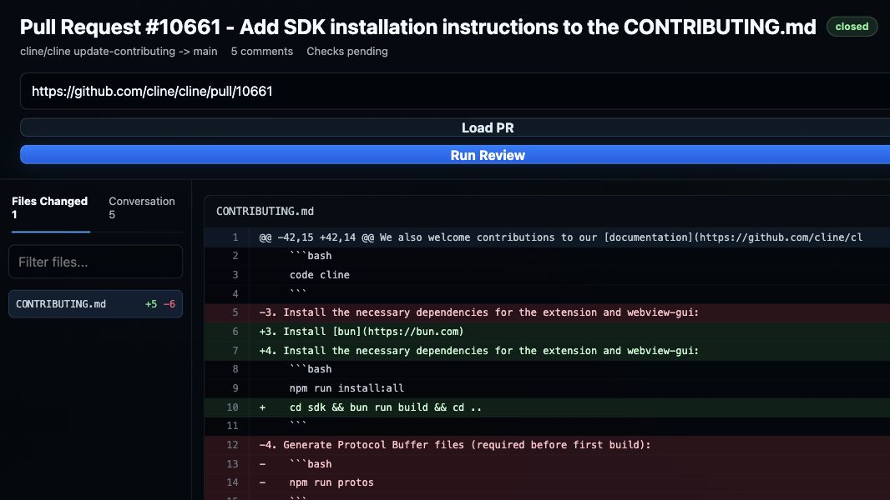

```text
████████╗██████╗ ██╗   ██╗███╗   ███╗██████╗  ██████╗ 
╚══██╔══╝██╔══██╗██║   ██║████╗ ████║██╔══██╗██╔═══██╗
   ██║   ██████╔╝██║   ██║██╔████╔██║██████╔╝██║   ██║
   ██║   ██╔══██╗██║   ██║██║╚██╔██║██╔══██╗██║   ██║
   ██║   ██║  ██║╚██████╔╝██║ ╚═╝ ██║██████╔╝╚██████╔╝
   ╚═╝   ╚═╝  ╚═╝ ╚═════╝ ╚═╝     ╚═╝╚═════╝  ╚═════╝ 
```

# Code Review Bot Dashboard

An AI code review dashboard that runs against real GitHub pull requests. Paste a PR URL, inspect the actual changed files, stream an SDK-powered review over the real PR diff, and copy or optionally post the generated review back to GitHub.

<p align="center">
  
</p>

## Getting started

Install dependencies and build the SDK workspace once:

```bash
bun install
bun run build:sdk
```

Set a provider API key. Trumbo is bring-your-own-key, so use a key from the model provider you configured:

```bash
export TRUMBO_API_KEY="trumbo_..."
```

Optionally set a GitHub token. Public PRs load without one, but a token is recommended for private repositories and higher rate limits:

```bash
export GITHUB_TOKEN="github_pat_..."
```

Start the dashboard:

```bash
bun dev
```

Open <http://localhost:3457>, paste a GitHub pull request URL, and click **Run Review**.

By default the app copies the generated review to your clipboard. To let it post a summary comment back to GitHub, set `GITHUB_TOKEN` and enable posting explicitly:

```bash
export ENABLE_GITHUB_REVIEW_POSTING=1
```

Posting is opt-in on purpose: external writes only happen when you ask for them.

## What it does

1. Fetches a real GitHub PR — metadata, changed files, patches, and check status.
2. Renders the PR in a dashboard with file navigation, a diff view, review lanes, and finding cards.
3. Sends the real PR diff to an agent equipped with three custom tools:
   - `get_file_context` — reads full file contents from the PR head commit for surrounding context.
   - `add_review_finding` — records a structured finding with file, line, severity, category, and suggestion.
   - `submit_review` — a completion tool that ends the run with a summary and an approve / request-changes decision.
4. Streams findings to the browser over Server-Sent Events as the agent reviews the PR.
5. Copies the final review locally, or posts it as a GitHub PR comment when posting is explicitly enabled.

## Concepts demonstrated

- Multiple `createTool` definitions backed by zod schemas.
- `lifecycle: { completesRun: true }` to let a tool end the agent loop.
- A rich `systemPrompt` with structured instructions for the reviewer.
- Event subscription filtered by tool name.
- GitHub REST API integration for pull request metadata and diffs.
- Server-Sent Events (SSE) for a live review dashboard.
- Guarded external writes through an explicit posting opt-in.

## Notes

- For a simpler starting point, see [quickstart](../quickstart).
- For an interactive chat agent, see [cli-agent](../cli-agent).
